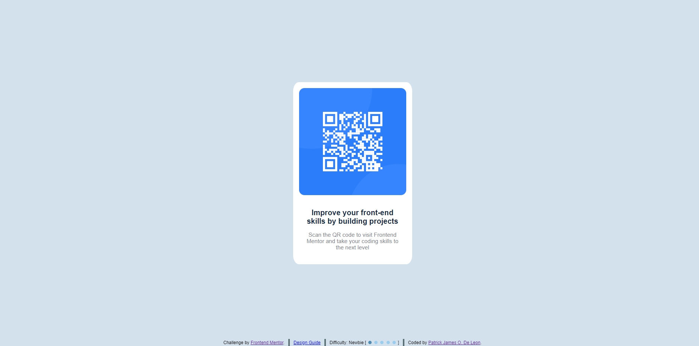

# Frontend Mentor - QR code component solution

This is a solution to the [QR code component challenge on Frontend Mentor](https://www.frontendmentor.io/challenges/qr-code-component-iux_sIO_H). Frontend Mentor challenges help you improve your coding skills by building realistic projects.

## Table of contents

- [Overview](#overview)
  - [Screenshot](#screenshot)
  - [Links](#links)
- [My process](#my-process)
  - [Built with](#built-with)
  - [What I learned](#what-i-learned)
  - [Continued development](#continued-development)
  - [Useful resources](#useful-resources)
- [Author](#author)
- [Acknowledgments](#acknowledgments)

## Overview

### Screenshot

### Links

- Solution URL: [Add solution URL here](https://github.com/EcePJD/frontendMentor_qrCode_Challenge)
- Live Site URL: [Add live site URL here](https://ecepjd.github.io/frontendMentor_qrCode_Challenge/)

## My process
This challenge was checking my knowledge in basic html and css. My original plan was just to use flex box and be done with it. But I wanted to try using the calc function of the css.

The first thing I did was to input all the html elements that will be used to recreate the design. I used the 'div', 'span', and 'a' elements and added classes and ids to be used in the css design.

Since the color, and font was indicated in the styles guide of the challenge, I just followed it and used photoshop to accurately get the messurements of the div and image size. I centered the container using the calc function since based on the design guide, the size of the container and its children are fixed.

### Built with
- Semantic HTML5 markup
- CSS custom properties
- Mobile-first workflow

### What I learned
I've been fairly knowledgeable in website development and have work experience in it. I've self studied programming and the problem with it is that I only studied and implemented the 'Things' that interest me. That's why even this basic challenge took me almost an hour. I never knew that you could use calc inside css and that's what I learned in this challenge.

## Author

- Github - [@EcePJD](https://github.com/EcePJD)
- Frontend Mentor - [@EcePJD](https://www.frontendmentor.io/profile/EcePJD)
- Facebook - [@ECEPJDeLeon](https://www.facebook.com/ECEPJDeLeon)